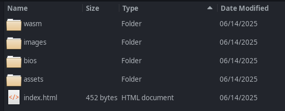
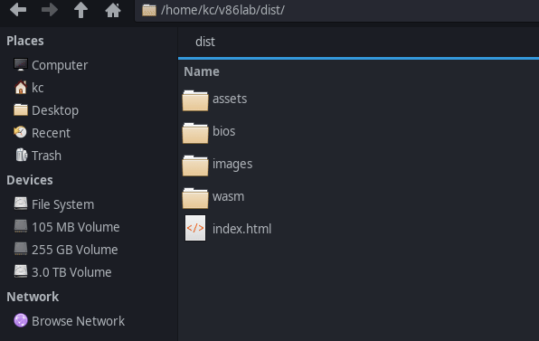
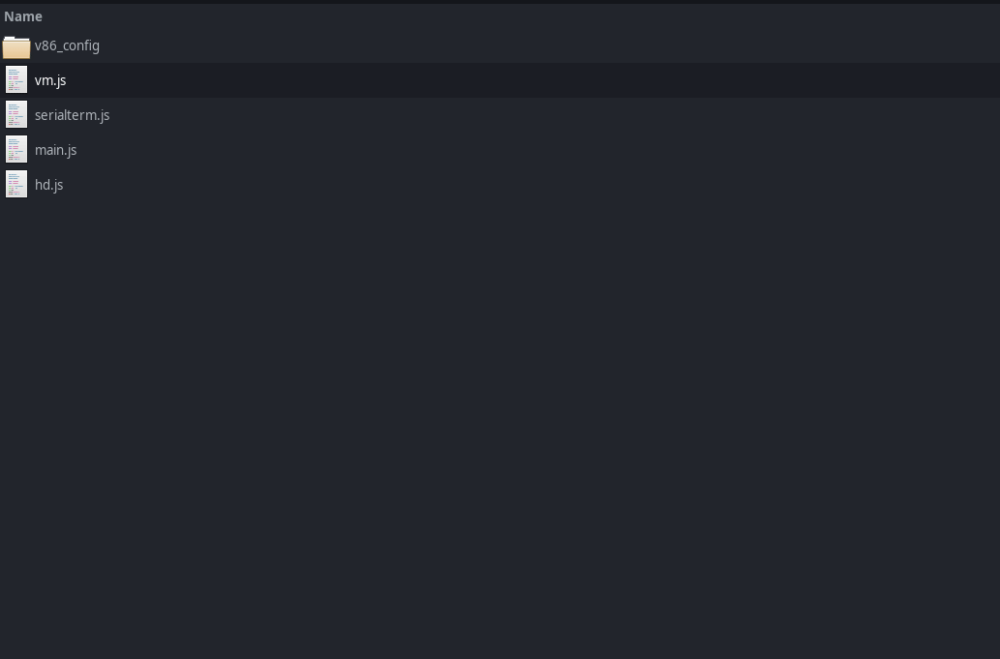
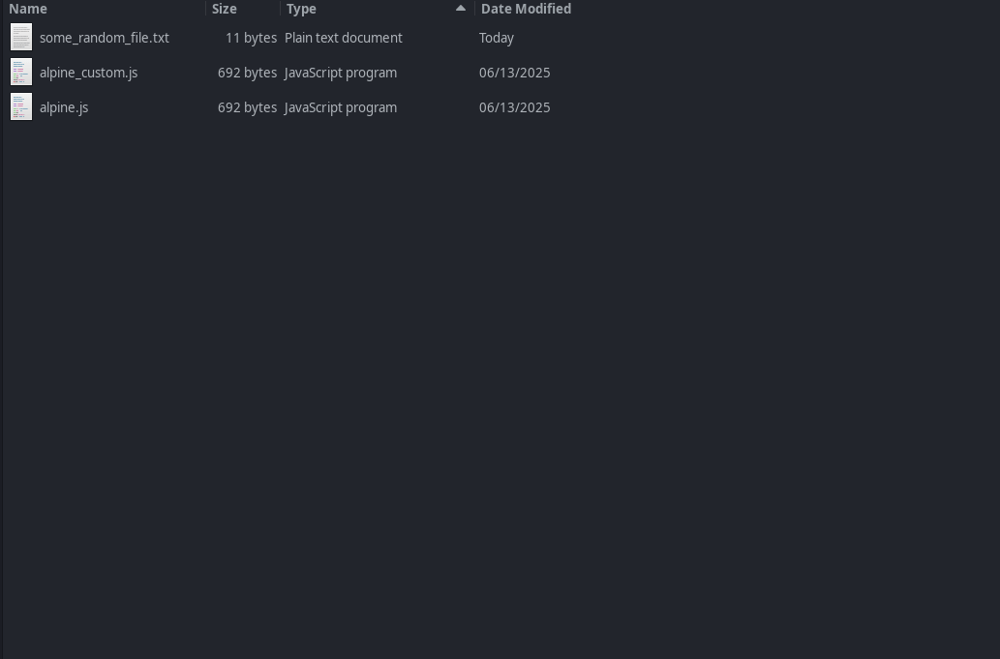
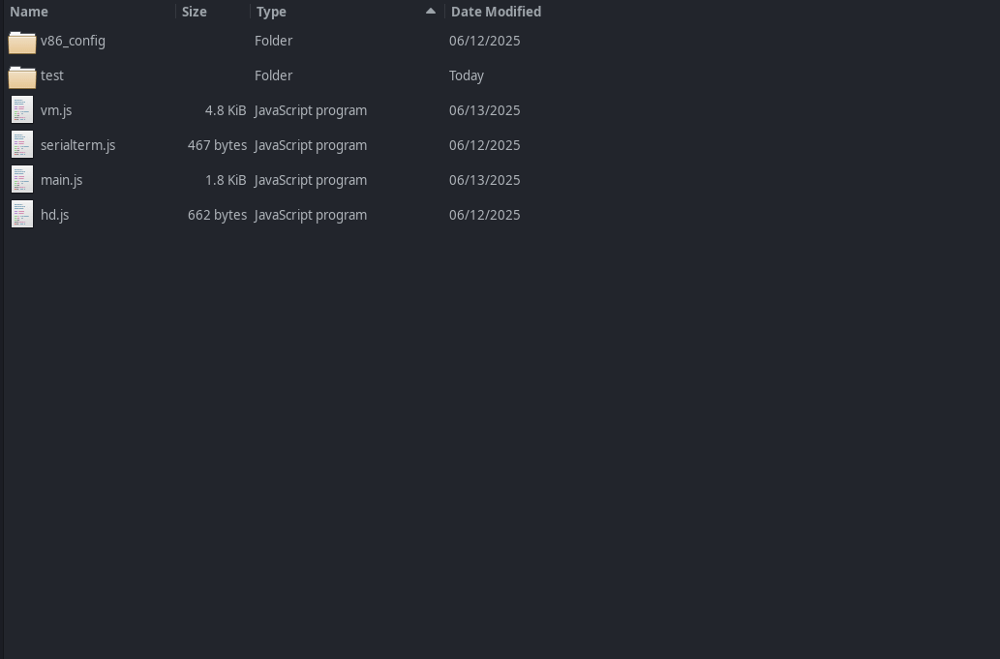

# Shell 101

Ceci est une introduction de base au shell Linux, couvrant les commandes essentielles et les concepts pour bien débuter avec l'utilisation du terminal.


Le shell Linux est un outil puissant qui vous permet d’interagir avec le système d’exploitation, d’exécuter des commandes et d’automatiser des tâches.

## A : Exécution de commandes

Exécutez des commandes en entrant le nom de la commande suivi de la touche Entrée.

Exemple :
Ici `uname` est un programme qui existe sur votre système. Il affiche des informations sur le système d'exploitation.
Pour exécuter ce programme, tapez simplement une commande commançant par le nom de ce programme dans le terminal :

```
uname
```
Le shell exécutera le programme et affichera sa "sortie" dans le terminal.
La "sortie" est l'information affichée par le programme lors de son exécution. Ici `uname` affiche des informations sur le système d'exploitation, comme le nom du noyau, la version, l'architecture, etc.

#### Exercice :
Décrivez ce que fait la commande `cal` :

<div>{.hint-101-a}
Tapez simplement la commande `cal` dans le terminal et appuyez sur Entrée. Ensuite, décrivez ce que vous voyez.
</div>

<div hidden class="solution"></div>


## B : Arguments de commande

Une commande peut prendre des `arguments` sous la forme :

```
programme --argument1 --argument2=toto
```

La plupart des commandes acceptent l’argument `--help` qui décrit comment utiliser la commande.

Exemple:

```
uname --help
```

Si vous avez besoin de plus de détails, vous pouvez utiliser la commande `man` pour lire la page de manuel d'une commande :

```
man uname
```

La plupart des commandes peuvent accepter des arguments longs ainsi que leur équivalent court.

Par exemple : `uname --operating-system` et `uname -o` sont équivalents.

#### Exercice:
Vous devez utiliser la commande `cal` avec les arguments appropriés pour afficher l’année complète.
Que devez-vous taper dans le terminal pour y parvenir ?

<div class="hint">
</div>

Les arguments servent à modifier le comportement d'une commande ou à fournir des informations supplémentaires.

Pour utiliser des arguments avec une commande, il suffit de les ajouter après le nom du programme.

La plupart des commandes disposent d'une option `--help` qui fournit des informations sur l'utilisation de la commande et ses arguments.


Vous pouvez également consulter la page de manuel d'une commande avec la commande `man`.


Lisez ensuite le message d'aide ou la page de manuel de la commande `cal` pour trouver les arguments appropriés pour atteindre votre objectif.
</div>

<div hidden class="solution"></div>

## C : Commandes de base

Dans les exercices suivants, vous utiliserez le terminal pour naviguer dans le système de fichiers, créer des répertoires, copier des fichiers et éditer des fichiers.

Nous vous fournirons les commandes avec leurs arguments, mais vous pouvez toujours consulter les pages de manuel pour plus d'informations.

Vous connaissez peut-être déjà certaines de ces commandes via une interface graphique, mais dans le terminal, nous utilisons des commandes pour effectuer ces actions.

### 1. `ls`

Lister les fichiers dans le répertoire courant.
Exemple :

```
ls
```

Dans une interface graphique, vous pouvez voir les fichiers et dossiers dans le répertoire courant grâce à votre explorateur de fichiers.



Lister les fichiers, y compris les fichiers cachés.
Dans les systèmes Unix et similaires, les fichiers et dossiers qui commencent par un point (`.`) sont considérés comme cachés. Pour les lister, utilisez l’option `-a` :

```
ls -a
```

#### Exercice :
Listez les éléments dans le répertoire courant. Combien d’éléments sont présents ? Combien de fichiers cachés ?

<div class="hint">
</div>

<div>{.hint-101-c-1}
Ça ne coûte rien de consulter la page de manuel de la commande `ls` pour voir quelles options sont disponibles.
</div>

<div hidden class="solution"></div>

Avez-vous remarqué les répertoires `.` et `..` ?
- `.` fait référence au répertoire courant
- `..` fait référence au répertoire parent

Pour lister le contenu du répertoire parent :

```
ls ..
```

Pour plus de détails sur les fichiers, utilisez l’option `-l` :

```
ls -l
```

Essayez :
Listez les fichiers du répertoire courant avec les détails. Quelle est la taille (en octets) du fichier `memo1.txt` ? Quelle est sa date de dernière modification ? Combien d’éléments listés sont des répertoires ?

### 2. `whoami`

La commande `whoami` permet d’afficher l’utilisateur actuellement connecté au système.
Sur un système Linux, chaque utilisateur possède un nom unique qui le distingue. Les utilisateurs peuvent avoir des permissions et des accès différents aux fichiers (nous y reviendrons plus tard).

### Exercice :
Exécutez la commande `whoami` dans le terminal. Quel est le nom de l’utilisateur connecté ?

### 3. `pwd`

Affiche le chemin absolu du répertoire de travail courant.
Exemple :

```
pwd
```

#### Exercice :
Affichez le répertoire de travail actuel. Quel est son chemin absolu ?

<div class="hint">
</div>

<div class="hint">
La commande `pwd` permet d’afficher le répertoire de travail actuel, c’est-à-dire celui dans lequel vous vous trouvez.
Vous pouvez l’utiliser pour savoir où vous êtes dans l’arborescence du système de fichiers.
Un chemin commençant par `/` est un chemin absolu (depuis la racine du système). S’il ne commence pas par `/`, c’est un chemin relatif (par rapport à votre position actuelle).
</div>

<div hidden class="solution"></div>

### 4. `cd`

Changer de répertoire.
Exemple :

```
cd /tmp
```

Sur une interface graphique, vous pouvez naviguer dans les répertoires en cliquant sur les dossiers présent sur votre explorateur de fichier.



Astuces :
Aller dans le dossier personnel :

```
cd
```

Aller dans le répertoire parent :

```
cd ..
```

#### Exercice :
Changez de répertoire vers `/tmp`.
Listez le contenu du **répertoire parent** de `/tmp`. Quelle entrée n'est pas présente parmi : "app", "bin", "etc", "home", ou "var" ?

<div class="hint">
You can always use the `pwd` command to check your current working directory.
</div>

<div hidden class="solution"></div>

### 5. `mkdir`

Retourne dans votre répertoire personnel avec `cd` (sans argument, `cd` vous ramène dans votre répertoire personnel):

```
cd
```

Créer un nouveau répertoire.
Exemple :

```
mkdir <nouveau_dossier>
```



#### Exercice :
D’abord, allez dans votre dossier personnel avec `cd`.
Puis créez un dossier nommé `101` dans votre dossier personnel.
Ce dossier sera votre répertoire de travail pour la suite des exercices.

<div hidden class="solution"></div>


## D : Copier / Déplacer / Renommer des fichiers
Comme dans tout système d'exploitation, les fichiers et dossiers peuvent être copiés, déplacés ou renommés. Vous connaissez peut-être déjà ces opérations via une interface graphique, mais ici, nous utilisons des commandes.

### 1 - Copier un fichier : cp
Copier un fichier :

``` 
cp <source> <destination>
```


Copier un répertoire et tout son contenu :


``` 
cp -r <source> <destination>
```


#### Exercice :
Copiez les fichiers et dossiers suivants dans votre répertoire `101` (créé dans l'exercice C-5) :

- memo1.txt

- memo2.txt

- Le dossier `memos`

- .secret1.txt

- .secret2.txt

- Le dossier `links` et tout son contenu

- Le dossier `works` et tout son contenu

- Le dossier `code` et tout son contenu

Ensuite, allez dans le dossier `101` et vérifiez que tout a bien été copié.

### 2 - Déplacer / Renommer : mv
La commande mv permet de déplacer ou renommer des fichiers ou dossiers.
```
mv <source> <destination>
```


#### Exercice :
Déplacez `memo1.txt` et `memo2.txt` dans le dossier `memos` .
Puis, dans le dossier `links`, renommez le fichier `qrcode1` en `wikipedia_linux` et `qrcode2` en `ubuntu`.
Enfin, rendez visibles les fichiers cachés dans `/home/user42/101/`.

<div hidden class="solution"></div>

## E : Créer, éditer, supprimer un fichier
### 1 - cat : afficher le contenu des fichiers

```
cat <fichier>
```

```
cat <fichier1> <fichier2>
```

#### Exercice :
Utilisez cat pour afficher le contenu de `secret1.txt`. De quoi parle ce fichier ?

<div class="hint">
Lisez bien le contenu de ce fichier si vous voulez une astuce sympa sur l’utilisation du terminal.
</div>


### 2 - micro : éditeur de texte

Micro est un éditeur de texte simple pour Linux.

- Ctrl-S : Enregistrer le fichier
- Ctrl-Q : Quitter l’éditeur
- Ctrl-A : Tout sélectionner
- Shift+flèches : Sélection à partir du curseur
- Ctrl-C : Copier la sélection
- Ctrl-V : Coller
- Ctrl-X : Couper

```
micro <fichier>
```


#### Exercice :
Utilisez micro pour éditer `memo2.txt` dans le dossier `memos` :

- Supprimez la ligne en double

- Ajoutez la ligne suivante à la fin du fichier :

```
- Convaincre un chat que je suis le chef
```

- Enregistrez le fichier et quittez l’éditeur.

<div class="hint">
Il existe de nombreux éditeurs de texte sous Linux, mais micro est simple et facile à prendre en main.
D'autres éditeurs connus sont nano, vi, vim, et emacs, mais ils demandent plus d’apprentissage (sauf peut-être nano, qui est aussi assez simple).
</div>

<div hidden class="solution"></div>

### 3 - `rm` et `rmdir` : supprimer un fichier / un répertoire

Pour supprimer un fichier :

```
rm <fichier>
```



Pour supprimer un répertoire **vide** :
```
rmdir <répertoire_vide>
```

Pour supprimer un répertoire et tout son contenu :
```
rm -r <répertoire>
```

#### Exercice :
- Supprimez le fichier `essay1.txt` dans le répertoire `works`. Assurez-vous de ne supprimer que le fichier `essay1.txt` et non le répertoire `works` lui-même.
- Supprimez le répertoire `code` et tout son contenu.

<div class="hint">
Vous pouvez toujours utiliser la commande `ls` pour vérifier le contenu d’un répertoire avant de le supprimer.
</div>

<div hidden class="solution"></div>


### Archivage :

Vous pouvez vouloir regrouper plusieurs fichiers et répertoires dans un seul fichier pour en faciliter le stockage ou le transfert. Cette opération s'appelle l'archivage.
Vous pouvez utiliser la commande `tar` pour créer une archive de fichiers et de répertoires.

Pour une archive simple (non compressée) :
```
tar -cf <nom_archive.tar> <fichiers à archiver>
```

Bon à savoir :
Les archives sont souvent utilisées pour compresser des fichiers et des répertoires afin d’économiser de l’espace ou de les transférer sur un réseau.
Vous pouvez utiliser la commande `tar` pour créer une archive, puis la compresser avec `gzip`.
Vous connaissez peut-être le format `.zip`, mais `.tar.gz` est un format courant sous Linux.

Pour créer une archive compressée avec gzip :
```
tar -czf <nom_archive.tar.gz> <fichiers à archiver> 
```



# Livrable 1

Objectif : montrez que vous avez compris les commandes de base du shell et que vous pouvez manipuler des fichiers et des répertoires en autonomie.
Si vous avez un doute vous pouvez toujours vous référer aux exercices précédents.

## Consignes :

Revenez dans votre répertoire personnel et créez une archive du répertoire `101` et de tout son contenu, puis nommez-la `delivery_101.tar`.
Pour finir créez une **copie** (l'archive originale doit donc être préservée) de cette archive dans le répertoire `/delivery` en faisant en sorte le fichier copié soit caché.

<div hidden class="solution"></div>

<div class="hint">
Vous pouvez lister le contenu d'une archive avec la commande `tar -tf <nom_archive.tar>`.

Vous pouvez aussi extraire le contenu d'une archive avec la commande `tar -xf <nom_archive.tar>`. (Ce n’est pas nécessaire pour cet exercice, mais cela pourrait être très utile pour la suite.)
</div>