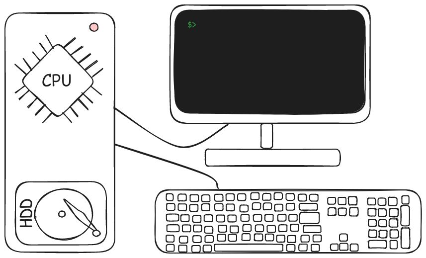
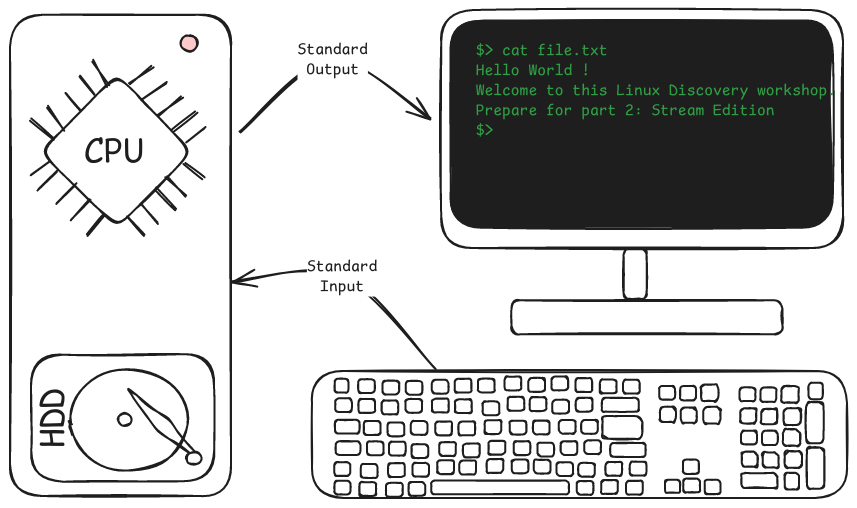
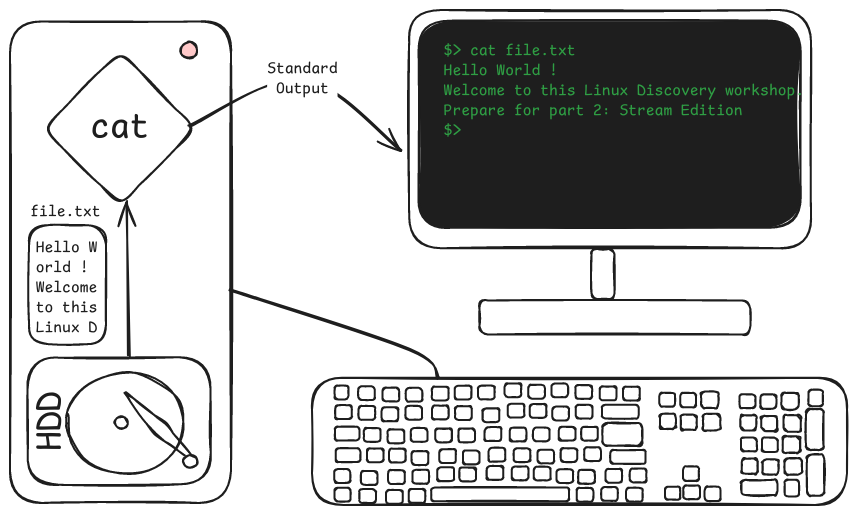
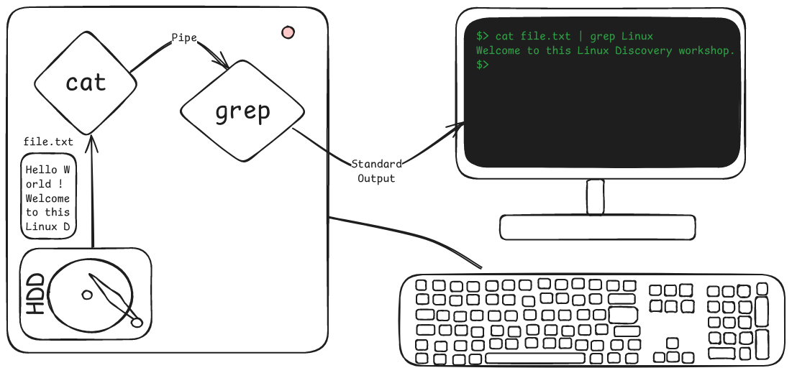
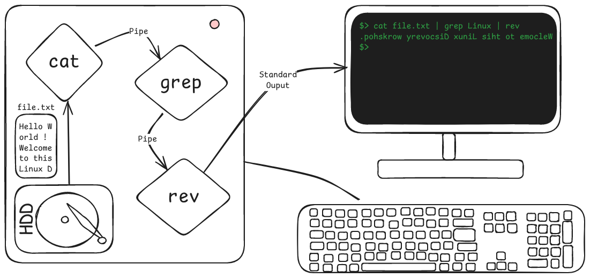
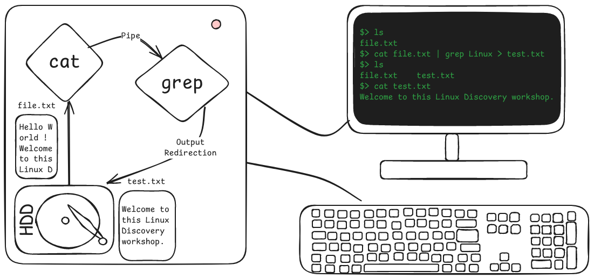

# Shell 101

Ceci est une introduction de base au shell Linux, couvrant les commandes essentielles et les concepts pour bien débuter avec l'utilisation du terminal.


Le shell Linux est un outil puissant qui vous permet d’interagir avec le système d’exploitation, d’exécuter des commandes et d’automatiser des tâches.

## A : Exécution de commandes

Exécutez des commandes en entrant le nom de la commande suivi de la touche Entrée.

Exemple :
Ici `uname` est un programme qui existe sur votre système. Il affiche des informations sur le système d'exploitation.
Pour exécuter ce programme, tapez simplement une commande commançant par le nom de ce programme dans le terminal :

```
uname
```
Le shell exécutera le programme et affichera sa "sortie" dans le terminal.
La "sortie" est l'information affichée par le programme lors de son exécution. Ici `uname` affiche des informations sur le système d'exploitation, comme le nom du noyau, la version, l'architecture, etc.

#### Exercice :
Décrivez ce que fait la commande `cal` :

<div class="hint">
Indice: Tapez simplement la commande `cal` dans le terminal et appuyez sur Entrée. Ensuite, décrivez ce que vous voyez.
</div>

<div hidden class="solution"></div>


## B : Arguments de commande

Une commande peut prendre des `arguments` sous la forme :

```
programme --argument1 --argument2=toto
```

La plupart des commandes acceptent l’argument `--help` qui décrit comment utiliser la commande.

Exemple:

```
uname --help
```

Si vous avez besoin de plus de détails, vous pouvez utiliser la commande `man` pour lire la page de manuel d'une commande :

```
man uname
```

La plupart des commandes peuvent accepter des arguments longs ainsi que leur équivalent court.

Par exemple : `uname --operating-system` et `uname -o` sont équivalents.

#### Exercice:
Vous devez utiliser la commande `cal` avec les arguments appropriés pour afficher l’année complète.
Que devez-vous taper dans le terminal pour y parvenir ?

<div class="hint">
Indice:

Les arguments servent à modifier le comportement d'une commande ou à fournir des informations supplémentaires.

Pour utiliser des arguments avec une commande, il suffit de les ajouter après le nom du programme.

La plupart des commandes disposent d'une option `--help` qui fournit des informations sur l'utilisation de la commande et ses arguments.


Vous pouvez également consulter la page de manuel d'une commande avec la commande `man`.


Lisez ensuite le message d'aide ou la page de manuel de la commande `cal` pour trouver les arguments appropriés pour atteindre votre objectif.
</div>

<div hidden class="solution"></div>

## C : Commandes de base

Dans les exercices suivants, vous utiliserez le terminal pour naviguer dans le système de fichiers, créer des répertoires, copier des fichiers et éditer des fichiers.

Nous vous fournirons les commandes avec leurs arguments, mais vous pouvez toujours consulter les pages de manuel pour plus d'informations.

Vous connaissez peut-être déjà certaines de ces commandes via une interface graphique, mais dans le terminal, nous utilisons des commandes pour effectuer ces actions.

### 1. `ls`

Lister les fichiers dans le répertoire courant.
Exemple :

```
ls
```

Dans une interface graphique, vous pouvez voir les fichiers et dossiers dans le répertoire courant grâce à votre explorateur de fichiers.


Lister les fichiers, y compris les fichiers cachés.
Dans les systèmes Unix et similaires, les fichiers et dossiers qui commencent par un point (`.`) sont considérés comme cachés. Pour les lister, utilisez l’option `-a` :

```
ls -a
```

#### Exercice :
Listez les éléments dans le répertoire courant. Combien d’éléments sont présents ? Combien de fichiers cachés ?

<div class="hint">
Indice: Ça ne coûte rien de consulter la page de manuel de la commande `ls` pour voir quelles options sont disponibles.
</div>

<div hidden class="solution"></div>

Avez-vous remarqué les répertoires `.` et `..` ?
- `.` fait référence au répertoire courant
- `..` fait référence au répertoire parent

Pour lister le contenu du répertoire parent :

```
ls ..
```

Pour plus de détails sur les fichiers, utilisez l’option `-l` :

```
ls -l
```

Essayez :
Listez les fichiers du répertoire courant avec les détails. Quelle est la taille (en octets) du fichier `memo1.txt` ? Quelle est sa date de dernière modification ? Combien d’éléments listés sont des répertoires ?

### 2. `whoami`

La commande `whoami` permet d’afficher l’utilisateur actuellement connecté au système.
Sur un système Linux, chaque utilisateur possède un nom unique qui le distingue. Les utilisateurs peuvent avoir des permissions et des accès différents aux fichiers (nous y reviendrons plus tard).

### Exercice :
Exécutez la commande `whoami` dans le terminal. Quel est le nom de l’utilisateur connecté ?

### 3. `pwd`

Affiche le chemin absolu du répertoire de travail courant.
Exemple :

```
pwd
```

#### Exercice :
Affichez le répertoire de travail actuel. Quel est son chemin absolu ?

<div class="hint">
Indice:
La commande `pwd` permet d’afficher le répertoire de travail actuel, c’est-à-dire celui dans lequel vous vous trouvez.
Vous pouvez l’utiliser pour savoir où vous êtes dans l’arborescence du système de fichiers.
Un chemin commençant par `/` est un chemin absolu (depuis la racine du système). S’il ne commence pas par `/`, c’est un chemin relatif (par rapport à votre position actuelle).
</div>

<div hidden class="solution"></div>

### 4. `cd`

Changer de répertoire.
Exemple :

```
cd /tmp
```

Sur une interface graphique, vous pouvez naviguer dans les répertoires en cliquant sur les dossiers présent sur votre explorateur de fichier.


Astuces :
Aller dans le dossier personnel :

```
cd
```

Aller dans le répertoire parent :

```
cd ..
```

#### Exercice :
Changez de répertoire vers `/tmp`.
Listez le contenu du **répertoire parent** de `/tmp`. Quelle entrée n'est pas présente parmi : "app", "bin", "etc", "home", ou "var" ?

<div class="hint">
Indice: You can always use the `pwd` command to check your current working directory.
</div>

<div hidden class="solution"></div>

### 5. `mkdir`

Retourne dans votre répertoire personnel avec `cd` (sans argument, `cd` vous ramène dans votre répertoire personnel):

```
cd
```

Créer un nouveau répertoire.
Exemple :

```
mkdir <nouveau_dossier>
```


#### Exercice :
D’abord, allez dans votre dossier personnel avec `cd`.
Puis créez un dossier nommé `101` dans votre dossier personnel.
Ce dossier sera votre répertoire de travail pour la suite des exercices.

<div hidden class="solution"></div>


## D : Copier / Déplacer / Renommer des fichiers
Comme dans tout système d'exploitation, les fichiers et dossiers peuvent être copiés, déplacés ou renommés. Vous connaissez peut-être déjà ces opérations via une interface graphique, mais ici, nous utilisons des commandes.

### 1 - Copier un fichier : cp
Copier un fichier :

``` 
cp <source> <destination>
```


Copier un répertoire et tout son contenu :


``` 
cp -r <source> <destination>
```


#### Exercice :
Copiez les fichiers et dossiers suivants dans votre répertoire `101` (créé dans l'exercice C-5) :

- memo1.txt

- memo2.txt

- Le dossier `memos`

- .secret1.txt

- .secret2.txt

- Le dossier `links` et tout son contenu

- Le dossier `works` et tout son contenu

- Le dossier `code` et tout son contenu

Ensuite, allez dans le dossier `101` et vérifiez que tout a bien été copié.

### 2 - Déplacer / Renommer : mv
La commande mv permet de déplacer ou renommer des fichiers ou dossiers.
```
mv <source> <destination>
```


#### Exercice :
Déplacez `memo1.txt` et `memo2.txt` dans le dossier `memos` .
Puis, dans le dossier `links`, renommez le fichier `qrcode1` en `wikipedia_linux` et `qrcode2` en `ubuntu`.
Enfin, rendez visibles les fichiers cachés dans `/home/user42/101/`.

<div hidden class="solution"></div>

## E : Créer, éditer, supprimer un fichier
### 1 - cat : afficher le contenu des fichiers

```
cat <fichier>
```

```
cat <fichier1> <fichier2>
```

#### Exercice :
Utilisez cat pour afficher le contenu de `secret1.txt`. De quoi parle ce fichier ?

<div class="hint">
Indice: Lisez bien le contenu de ce fichier si vous voulez une astuce sympa sur l’utilisation du terminal.
</div>

Bon à savoir: La commande `cat` permet de concatener plusieurs fichiers (les affichers les uns après les autres). Cela peut être très utile lorsqu'on souhaite "fusionner" plusieurs fichier en un seul (cf l'exercice final de la partie 2).


### 2 - micro : éditeur de texte

Micro est un éditeur de texte simple pour Linux.

- Ctrl-S : Enregistrer le fichier
- Ctrl-Q : Quitter l’éditeur
- Ctrl-A : Tout sélectionner
- Shift+flèches : Sélection à partir du curseur
- Ctrl-C : Copier la sélection
- Ctrl-V : Coller
- Ctrl-X : Couper

```
micro <fichier>
```


#### Exercice :
Utilisez micro pour éditer `memo2.txt` dans le dossier `memos` :

- Supprimez la ligne en double

- Ajoutez la ligne suivante à la fin du fichier :

```
- Convaincre un chat que je suis le chef
```

- Enregistrez le fichier et quittez l’éditeur.

<div class="hint">
Indice:
Il existe de nombreux éditeurs de texte sous Linux, mais micro est simple et facile à prendre en main.
D'autres éditeurs connus sont nano, vi, vim, et emacs, mais ils demandent plus d’apprentissage (sauf peut-être nano, qui est aussi assez simple).
</div>

<div hidden class="solution"></div>

### 3 - `rm` et `rmdir` : supprimer un fichier / un répertoire

Pour supprimer un fichier :

```
rm <fichier>
```


Pour supprimer un répertoire **vide** :
```
rmdir <répertoire_vide>
```

Pour supprimer un répertoire et tout son contenu :
```
rm -r <répertoire>
```

#### Exercice :
- Supprimez le fichier `essay1.txt` dans le répertoire `works`. Assurez-vous de ne supprimer que le fichier `essay1.txt` et non le répertoire `works` lui-même.
- Supprimez le répertoire `code` et tout son contenu.

<div class="hint">
Indice: Vous pouvez toujours utiliser la commande `ls` pour vérifier le contenu d’un répertoire avant de le supprimer.
</div>

<div hidden class="solution"></div>


### Archivage :

Vous pouvez vouloir regrouper plusieurs fichiers et répertoires dans un seul fichier pour en faciliter le stockage ou le transfert. Cette opération s'appelle l'archivage.
Vous pouvez utiliser la commande `tar` pour créer une archive de fichiers et de répertoires.

Pour une archive simple (non compressée) :
```
tar -cf <nom_archive.tar> <fichiers à archiver>
```

Bon à savoir :
Les archives sont souvent utilisées pour compresser des fichiers et des répertoires afin d’économiser de l’espace ou de les transférer sur un réseau.
Vous pouvez utiliser la commande `tar` pour créer une archive, puis la compresser avec `gzip`.
Vous connaissez peut-être le format `.zip`, mais `.tar.gz` est un format courant sous Linux.

Pour créer une archive compressée avec gzip :
```
tar -czf <nom_archive.tar.gz> <fichiers à archiver> 
```


# Livrable 1

Objectif : montrez que vous avez compris les commandes de base du shell et que vous pouvez manipuler des fichiers et des répertoires en autonomie.
Si vous avez un doute vous pouvez toujours vous référer aux exercices précédents.

## Consignes :

Revenez dans votre répertoire personnel et créez une archive du répertoire `101` et de tout son contenu, puis nommez-la `delivery_101.tar`.
Pour finir créez une **copie** (l'archive originale doit donc être préservée) de cette archive dans le répertoire `/delivery` en faisant en sorte le fichier copié soit caché.

<div hidden class="solution"></div>

<div class="hint">
Indice: Vous pouvez lister le contenu d'une archive avec la commande `tar -tf <nom_archive.tar>`.

Vous pouvez aussi extraire le contenu d'une archive avec la commande `tar -xf <nom_archive.tar>`. (Ce n’est pas nécessaire pour cet exercice, mais cela pourrait être très utile pour la suite.)
</div>
</div>

# Shell 102 : Édition de flux

Cette section vous introduit à des commandes essentielles du shell pour traiter des fichiers texte et manipuler des flux de données. Vous apprendrez à utiliser les pipes, les redirections, et diverses commandes de traitement de texte pour extraire et manipuler des informations à partir de fichiers.  
Vous apprendrez également à utiliser ces commandes pour résoudre des exercices pratiques.  
Pour les exercices suivants, vous devrez ajouter les résultats dans un fichier nommé `answers.txt` ou dans le fichier approprié si cela est spécifié dans l'exercice.

## Pipe et redirection

Bon à savoir : lorsqu'un programme est exécuté dans le shell, il lit le flux d'entrée standard (stdin) et écrit dans le flux de sortie standard (stdout). Le shell permet de rediriger ces flux vers des fichiers ou d'autres commandes.








Le pipe `|` est utilisé pour passer la sortie d'une commande en entrée d'une autre commande.  
La redirection `>` est utilisée pour rediriger la sortie d'une commande vers un fichier.

Vous pouvez enchaîner plusieurs commandes à l'aide de pipes.

La redirection avec `>>` ajoute la sortie à un fichier au lieu de l'écraser.

Dans les exercices suivants, vous utiliserez les pipes et les redirections pour traiter des fichiers texte et extraire des informations.

Hint:
Vous pouvez utiliser la commande `man` pour lire les pages de manuel des commandes que vous utiliserez afin d'en apprendre davantage sur leurs options et leur utilisation.

## Préliminaire : extraire le contenu d'une archive tar

Pour extraire le contenu d'une archive tar, vous pouvez utiliser la commande `tar` avec l'option `-xf` :

Exercice:

- Extrayez le contenu de l'archive `data_102.tar` dans votre répertoire personnel.  
- Ensuite, accédez au répertoire `data_102` nouvellement créé par l'extraction de l'archive.


## Préliminaire : un mot sur le format CSV

Le format CSV (Comma-Separated Values) est un format de fichier simple utilisé pour stocker des données tabulaires, comme des feuilles de calcul ou des bases de données. Chaque ligne d'un fichier CSV représente une ligne de données, et chaque valeur dans la ligne est séparée par une virgule (`,`), mais parfois d'autres caractères peuvent être utilisés comme séparateurs, tels que le point-virgule (`;`) ou un simple espace (` `).  
Ce format est largement utilisé car il est facile à lire et à écrire, et il peut être traité par de nombreuses applications, y compris des logiciels de tableur et des langages de programmation.  
Les fichiers CSV peuvent être ouverts dans des éditeurs de texte, des applications de tableur ou traités à l'aide de langages de programmation comme Python, R ou des commandes shell.

Par exemple, un fichier CSV pourrait ressembler à ceci:

```
Name,Age,City
Alice,30,Paris
Bob,25,Lyon
Charlie,35,Marseille
```

La première ligne est souvent utilisée comme en-tête pour décrire les colonnes, et les lignes suivantes contiennent les données réelles.  
Dans les exercices, vous rencontrerez des fichiers CSV contenant divers types de données, telles que des informations de vol, des notes, et plus encore. Vous apprendrez à manipuler ces fichiers à l'aide de commandes shell.

### grep

grep - imprimer les lignes qui correspondent à des motifs


Exercice:
 - Isolez la ligne contenant les informations sur le numéro de vol "AA7566" dans le fichier `flights.csv` et enregistrez-la dans un fichier nommé `flight_AA7566_info.txt`.
 - Quel est le numéro du vol qui **est arrivé** à 21h42 dans le fichier `flights.csv` ? (écrivez la réponse dans le fichier `answers.txt`)
 - Quel est le numéro de vol de celui opéré par "Air France" partant de l'aéroport Charles de Gaulle (CDG) et arrivant à l'aéroport du Caire (CAI) dans le fichier `flights.csv` ? (écrivez la réponse dans le fichier `answers.txt`)

 Indice: Vous pouvez utiliser la redirection pour enregistrer la sortie d'une commande dans un fichier.

### wc
wc - imprimer le nombre de nouvelles lignes, de mots et d'octets pour chaque fichier

```
wc -l <file> # compter les lignes contenues dans le fichier
wc -w <file> # compter les mots contenus dans le fichier
wc -c <file> # compter le nombre de charactères contenus dans le fichier
```

Astuce: La commande `grep` a également une option pour compter le nombre de lignes qui correspondent à un motif.

Exercice:
- Combien y a-t-il de vols dans le fichier `flights.csv` ? (écrivez la réponse dans le fichier `answers.txt`)
- Combien y a-t-il de vols opérés par "Air France" dans le fichier `flights.csv` ? (écrivez la réponse dans le fichier `answers.txt`)
- Combien de mots sont présents dans le fichier `wonderland.txt` ? (écrivez la réponse dans le fichier `answers.txt`)

Astuce: Comme "Air France" est une chaîne de caractères avec des espaces, vous devez mettre des guillemets autour lorsque vous utilisez la commande `grep`. Sinon, le shell interprétera les espaces comme des arguments séparés.


### sort
sort - trier les lignes de fichiers texte

```
sort -k  <key> -t <delimiter> <file>
```

- `-k <key>` spécifie la clé par laquelle trier (par exemple, `-k 3` pour trier par la troisième colonne)
- `-t <delimiter>` spécifie le délimiteur utilisé dans le fichier (par exemple, `-t ','` pour des valeurs séparées par des virgules)
- `-n` trie numériquement au lieu de lexicalement :
    - Par exemple, si vous triez les nombres "10" et "2":
        - en ordre lexicographique, "10" vient avant "2" (parce que "1" vient avant "2" dans la table ASCII : l'alphabet "computers")
        - en ordre numérique, "2" vient avant "10" (parce que 2 est inférieur à 10)
- `-r` inverse l'ordre de tri (par exemple, `-r` pour trier par ordre décroissant)

Exercices:
- Triez le fichier `grades.csv` par la troisième colonne (les notes) par ordre croissant et enregistrez le résultat dans un nouveau fichier nommé `sorted_grades.csv`. (écrivez la réponse dans le fichier `answers.txt`)
- Triez les vols dans le fichier `flights.csv` par aéroport d'arrivée (par ordre alphabétique), quel est le prix du billet du dernier vol dans la liste triée ? (écrivez la réponse dans le fichier `answers.txt`)
- Écrivez dans un fichier nommé `on_time_flights_sorted.csv` la liste des vols dans le fichier `flights.csv` avec un statut de vol marqué comme **à l'heure**, triée par le nombre de passagers par ordre croissant.

### head, tail

head - afficher la première partie des fichiers
head -n <number_of_lines> <file>
tail - afficher la dernière partie des fichiers
tail -n <number_of_lines> <file>


Exercice:
- Quelles sont les 5 dernières lignes du fichier `grades.csv`? (écrivez la réponse dans le fichier `answers.txt`)
- Quelles sont les 10 premières lignes du fichier `grades.csv`?
- Un peu plus difficile: Extraire 12 lignes du fichier `grades.csv` à partir de la 5ème ligne en **excluant la ligne d'en-tête** et enregistrez-les dans un nouveau fichier nommé `grades_sample.txt` (Astuce: Vous pouvez utiliser une combinaison de `head` et `tail` avec des pipes pour extraire les lignes souhaitées).

### cut

cut - supprimer des colonnes de chaque ligne des fichiers

```
cut -d <delimiter> -f <fields> <file>
```

- `-d <delimiter>` spécifie le délimiteur utilisé dans le fichier (par exemple, `-d ','` pour des valeurs séparées par des virgules)
- `-f <fields>` spécifie les champs à extraire (par exemple, `-f 1,2` pour extraire le premier et le deuxième champ)

Exercice:
- Extraire la dernière colonne du fichier `grades.csv` (les notes) et enregistrez-la dans un nouveau fichier nommé `grades_only.txt`.
- Dans le fichier `cars.csv`, extraire les 4 premières colonnes (séparées par des virgules) et enregistrez le résultat dans un nouveau fichier nommé `cars_without_personal_info.csv`.


### uniq
uniq - omettre les lignes répétées

La commande `uniq` est utilisée pour filtrer les lignes répétées dans un fichier. Elle ne fonctionne que sur des fichiers triés, donc vous devrez peut-être d'abord trier le fichier.

Exercice:
- Combien de marques de voitures uniques sont présentes dans le fichier `cars.csv`? (écrivez la réponse dans le fichier `answers.txt`)
Astuce: Rappelez-vous des commandes précédemment vues et essayez de les combiner à l'aide de pipes pour obtenir le résultat souhaité.

Bon à savoir: La commande `sort` peut également être utilisée avec une option spécifique pour supprimer les doublons lors du tri. Cela peut être utile si vous souhaitez trier le fichier et supprimer les doublons en une seule étape.

### sed

sed - éditeur de flux pour filtrer et transformer du texte

```
sed 's/<search>/<replace>/g' <file>
```
- `s/<search>/<replace>/g` remplace toutes les occurrences de `<search>` par `<replace>` dans le fichier

Essayez:  
Remplacez le mot "Alice" par "4l1c3" dans le fichier `wonderland.txt` et enregistrez le résultat dans un nouveau fichier nommé `w0nd3rl4nd.txt`.

# Livrable 2:

# Prérequis:

Désarchivez l'archive `data_102_delivery.tar` dans votre répertoire personnel.
Extrayez le contenu de l'archive `data_102_delivery.tar` dans votre répertoire personnel.  
Ensuite, accédez au répertoire `data_102_delivery` nouvellement créé par l'extraction de l'archive.  
Dans le répertoire extrait, vous trouverez un ensemble de fichiers et de répertoires.  
Ensuite, procédez à la section suivante pour apprendre à utiliser les commandes `find` et `xargs` ainsi que des techniques plus avancées avec `grep`.

## find et xargs

La commande `find` est utilisée pour rechercher des fichiers et des répertoires dans une hiérarchie de répertoires. Elle peut être utilisée pour trouver des fichiers en fonction de divers critères, tels que le nom, le type, la taille, la date de modification, et plus encore.

La syntaxe de base de la commande `find` est:
```
find <path> <options> <expression>
```

Où:
- `<path>` est le répertoire dans lequel rechercher (par exemple, `.` pour le répertoire courant)
- `<options>` sont des options qui modifient le comportement de la commande `find` (par exemple, `-name` pour rechercher par nom, `-type` pour rechercher par type, `-mtime` pour rechercher par date de modification)
- `<expression>` est l'expression à correspondre (par exemple, `*.txt` pour correspondre à tous les fichiers texte)

Exemple:
```
find . -name "*.txt"
```
Cette commande trouve tous les fichiers avec l'extension `.txt` dans le répertoire courant et ses sous-répertoires.  
Notez que le caractère `*` (caractère générique) est utilisé pour correspondre à n'importe quel caractère dans le nom du fichier.

La commande `xargs` est utilisée pour construire et exécuter des lignes de commande à partir de l'entrée standard. Elle est souvent utilisée en combinaison avec `find` pour effectuer des actions sur les fichiers trouvés par `find`.

La syntaxe de base de la commande `xargs` est:
```
xargs <command>
```

Où:
- `<command>` est la commande à exécuter sur les lignes données en entrée à `xargs`.
Exemple:
```
find . -name "*.txt" | xargs wc -l
```
Cette commande trouve tous les fichiers texte dans le répertoire courant et ses sous-répertoires, puis compte le nombre de lignes dans chaque fichier à l'aide de la commande `wc -l`.

Ou vous pouvez utiliser l'option `-exec` de la commande `find` pour exécuter une commande sur chaque fichier trouvé:
```
find . -name "*.txt" -exec wc -l {} \;
```
Cette commande fait la même chose que la précédente, mais utilise l'option `-exec` de `find` pour exécuter la commande `wc -l` sur chaque fichier trouvé. Les `{}` sont des espaces réservés pour le nom du fichier, et `\;` indique la fin de la commande.


#### Exercice final - A:
- Trouvez tous les fichiers avec l'extension `.csv` dans le répertoire courant et ses sous-répertoires,
  et comptez le nombre de lignes dans chaque fichier à l'aide de la commande `wc -l`.
- Trouvez tous les fichiers avec l'extension `.csv` dans le répertoire courant et ses sous-répertoires,
  et comptez le nombre de fichiers CSV vides.
- Trouvez tous les fichiers avec l'extension `.csv` dans le répertoire courant et ses sous-répertoires,
    et concaténez leur contenu dans un fichier unique nommé `all_data.csv`.

## Grep avancé

La commande `grep` est un outil puissant pour rechercher du texte dans des fichiers. Elle peut être utilisée pour rechercher des motifs dans des fichiers, et elle prend en charge les expressions régulières pour des recherches plus complexes.

La syntaxe de base de la commande `grep` est:
```
grep <options> <pattern> <file>
```

Avec l'option `-v`, vous pouvez inverser la recherche, c'est-à-dire qu'elle renverra les lignes qui ne correspondent pas au motif.

Exemple:
```
grep -v "pattern" file.txt
```
Cette commande recherche des lignes dans `file.txt` qui ne contiennent pas le mot "pattern".

Avec l'option `-E`, vous pouvez activer les expressions régulières étendues, qui permettent une correspondance de motifs plus complexe.

Exemple 1:
```
grep -E "pattern1|pattern2" file.txt
```
Cette commande recherche des lignes dans `file.txt` qui correspondent à `pattern1` ou `pattern2`.

Exemple 2:
```
grep -E "^42" file.txt
```
Cette commande recherche des lignes dans `file.txt` qui commencent par le numéro `42`.

Exemple 3:
```
grep -E "pattern1$" file.txt
```
Cette commande recherche des lignes dans `file.txt` qui se terminent par `pattern1`.

Bien sûr, vous pouvez combiner ces options avec d'autres options de `grep`.

L'expression peut être combinée entre elles pour créer des recherches encore plus complexes.

Exemple:
```
grep -E "^patern1|pattern2$" file.txt
```
Cette commande recherche des lignes dans `file.txt` qui commencent par `pattern1` **ou** se terminent par `pattern2`.

Attention aux caractères spéciaux dans le motif, tels que `.`, `*`, `?`, `$`, `^`, etc. Ces caractères ont des significations spéciales dans les expressions régulières et peuvent devoir être échappés avec un antislash (`\`) si vous voulez les faire correspondre littéralement.

Exemple:
```
grep -E "pattern\*" file.txt
```
Cette commande recherche des lignes dans `file.txt` qui contiennent la chaîne littérale `pattern*`.  
Si vous deviez utiliser `grep -E "pattern*"` sans échapper l'astérisque en le précédant d'un (`\`), cela ferait correspondre toute ligne contenant `pattern` suivi de zéro ou plusieurs occurrences de n'importe quel caractère (l'astérisque serait interprété comme un caractère générique), ce qui n'est pas ce que vous voulez dans ce cas.

#### Exercice final - B:
Des erreurs sont présentes dans le CSV de l'exercice précédent.

En effet, certaines lignes contiennent des adresses IP invalides, votre tâche est de trouver ces lignes et de créer un nouveau fichier nommé `all_data_valid_ip.csv` qui contient uniquement les adresses IP valides (nous ne nous soucions que de l'adresse IP, les autres champs peuvent être laissés de côté).
Et enregistrez les adresses IP invalides (ici aussi, nous ne nous soucions que de l'adresse IP, les autres champs peuvent être laissés de côté) dans un fichier nommé `all_data_invalid_ip.csv`.
Enfin, créez une archive nommée `all_data.tar.gz` qui contient les fichiers `all_data.csv`,  `all_data_valid_ip.csv` et `all_data_invalid_ip.csv`.

Astuce: Les adresses IP invalides dans ces fichiers commencent soit par un "0." (par exemple, `0.153.42.12`), soit se terminent par un ".0" (par exemple, `12.0.7.0`).

Astuce: Pour compresser l'archive à l'aide de gzip, vous pouvez utiliser l'option appropriée avec la commande `tar` (lisez la page de manuel de la commande `tar` pour trouver l'option). Ou vous pouvez d'abord créer l'archive puis la compresser à l'aide de la commande `gzip` avec l'option appropriée (lisez la page de manuel de la commande `gzip` pour trouver l'option).

